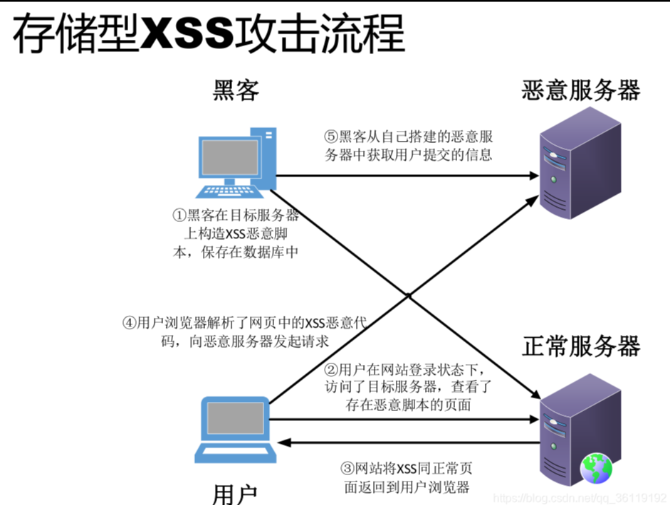
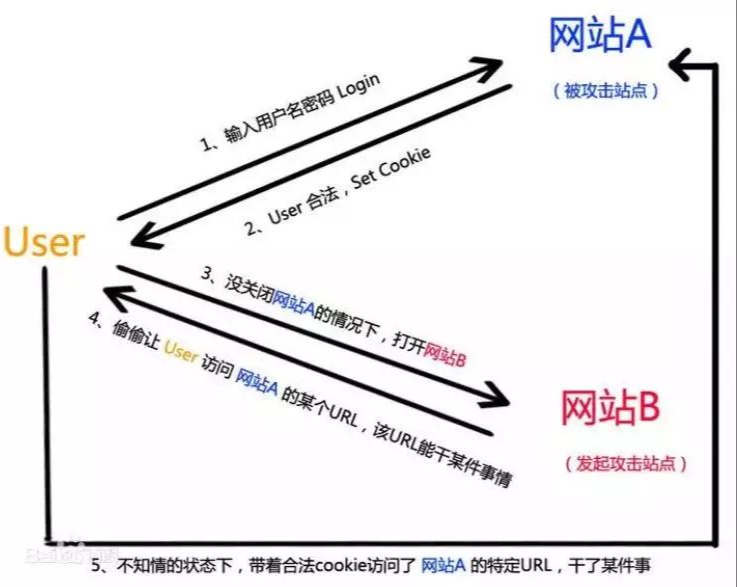
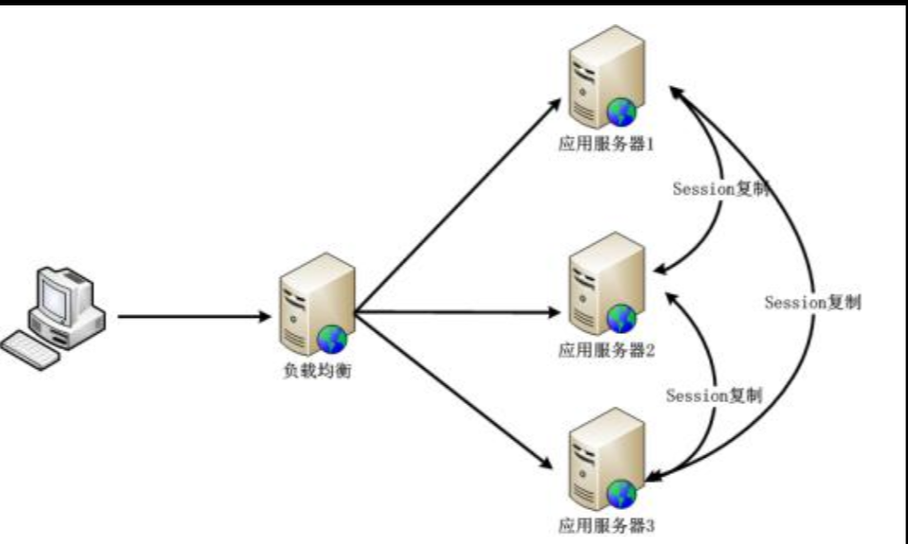
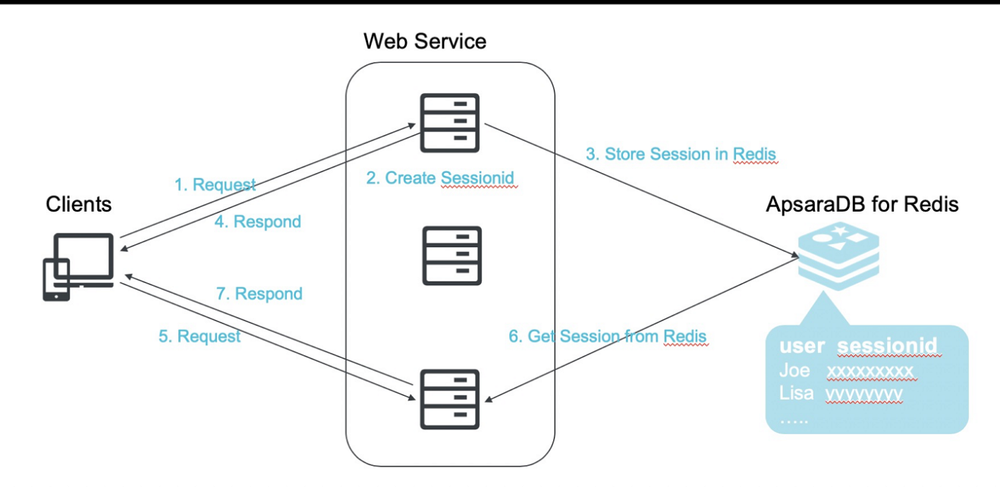
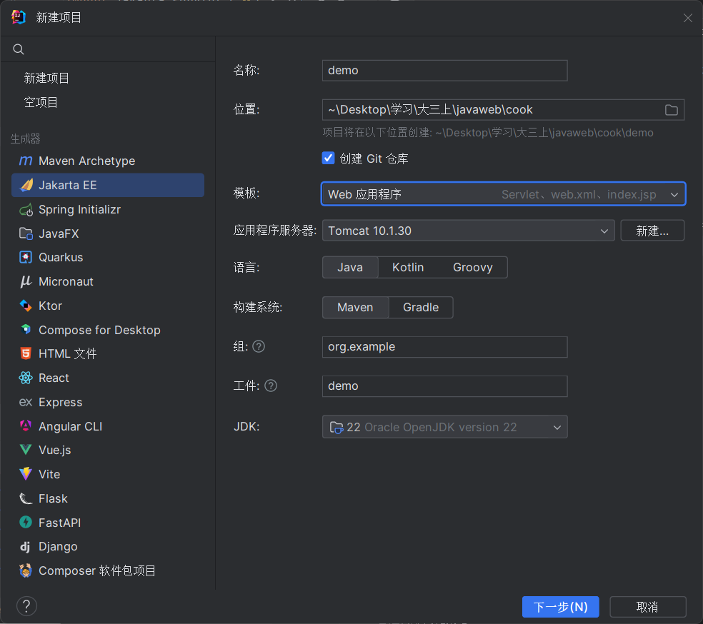
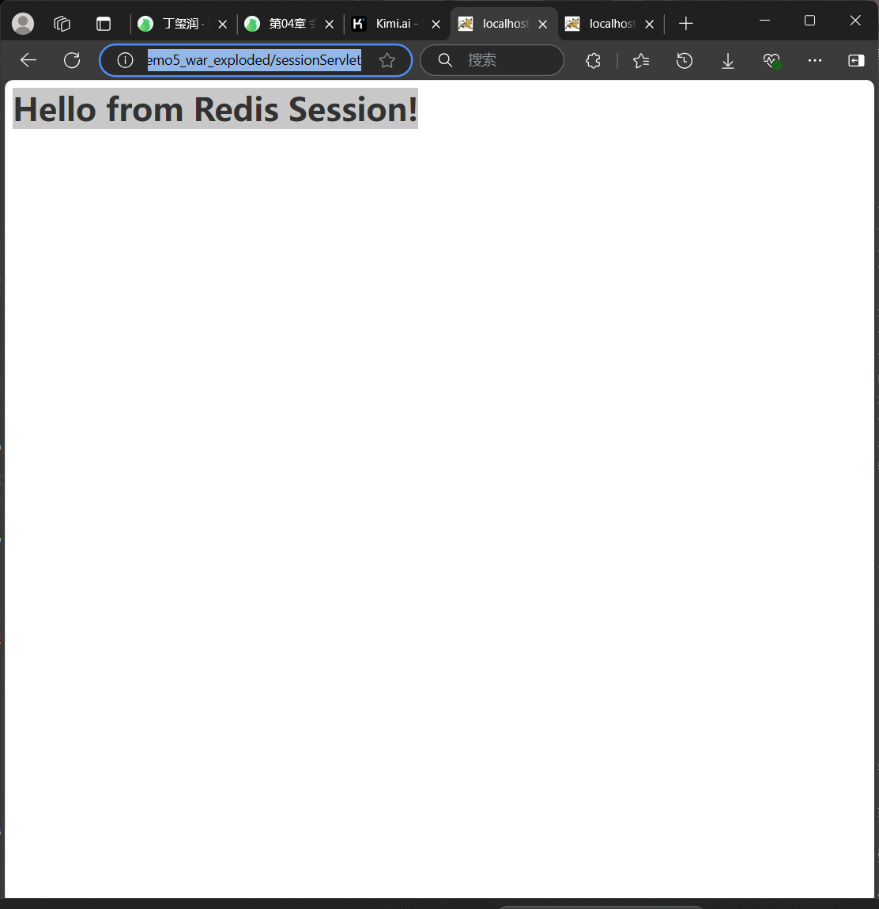
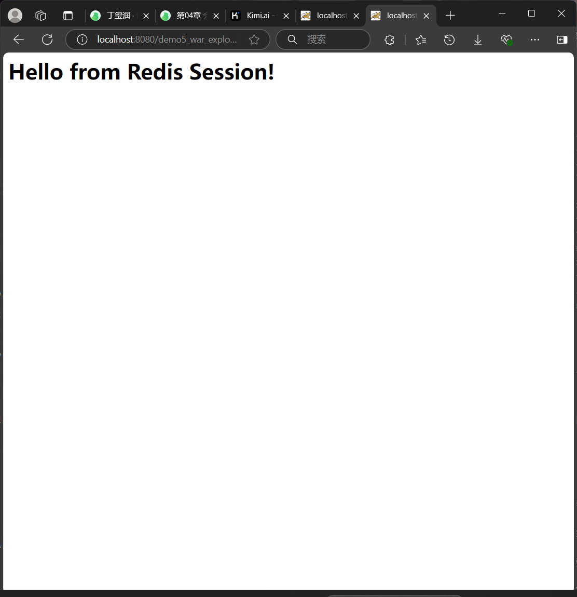

# 扩展内容(作业)


***
1. 会话安全性

   ● 会话劫持和防御

   会话劫持（Session Hijacking）是一种网络攻击方式，攻击者通过某种手段获取到用户的会话标识（Session ID），然后使用这个会话标识冒充合法用户进行恶意操作。这种攻击方式允许攻击者以合法用户的身份访问受保护的资源，从而可能导致用户的隐私泄露、账户被盗、数据篡改等安全问题
   。
为了提高网络会话的安全性，所采取的例如使用HTTPS、设置HttpOnly属性等都是会话防御手段。


   ● 跨站脚本攻击（XSS）和防御


这个是攻击的流程图


跨站脚本攻击（XSS）是一种常见的网络安全漏洞，它允许攻击者将恶意脚本注入到网站页面中，当其他用户访问这些页面时，恶意脚本会在用户的浏览器上执行，可能导致信息窃取、账户劫持、网站篡改等安全问题
。

XSS攻击主要分为三类：

1.存储型XSS：攻击脚本存储在目标服务器的数据库中，当用户访问特定页面时，脚本自动执行。

2.反射型XSS：攻击脚本存在于URL中，用户点击恶意链接后，服务器将恶意脚本反射回用户浏览器执行。

3.DOM型XSS：攻击基于客户端DOM解析错误，不需要服务器参与，攻击脚本通过修改页面的DOM结构来触发漏洞。

防御XSS攻击的措施

1.输入验证与过滤：对用户输入的数据进行严格的验证和过滤，拒绝或过滤掉含有潜在危险字符的输入。

2.输出编码：在将数据输出到HTML、JavaScript、CSS或URL中时，进行适当的编码，以防止恶意脚本的执行。

3.启用内容安全政策（CSP）：通过设置CSP响应头，限制网页上能执行的脚本和加载的资源，有助于阻止恶意脚本的执行。

4.使用安全库和框架：利用现代Web开发框架提供的安全特性，如自动转义输出、防止跨站请求伪造（CSRF）等。

5.定期审计与测试：进行定期的代码审查和安全测试，以发现和修复潜在的XSS漏洞。


   ● 跨站请求伪造（CSRF）和防御



跨站请求伪造（CSRF）是一种网络安全攻击，攻击者通过诱导用户在已认证的Web应用程序上执行非本意的操作，如转账、修改密码等。这种攻击利用了用户浏览器中保存的认证凭据（如Cookie、Session等），在用户不知情的情况下，向受信任的网站发送恶意请求。

CSRF攻击的工作原理：

1.用户登录受信任网站A，并保持登录状态。

2.用户访问恶意网站B，该网站包含针对网站A的恶意请求。

3.恶意请求自动携带用户在网站A的认证信息（如Cookie）。

4.网站A接收到请求，并误以为是用户本人的操作，执行相应的动作。


***
2. 分布式会话管理



   ● 分布式环境下的会话同步问题

在分布式环境下，会话同步问题是一个挑战，因为不同的服务器可能无法访问彼此的本地会话存储。


   ● Session集群解决方案

1.Session复制：每个服务器都存储所有用户的Session信息，任何服务器都可以处理任何用户的请求。这种方法的缺点是同步延迟和资源消耗较大。

2.Session粘滞性（Sticky Sessions）：通过负载均衡器的配置，确保用户的请求总是被发送到同一个服务器。这种方法的缺点是限制了负载均衡的能力，并且如果服务器宕机，Session会丢失。

3.使用中央存储：如数据库或缓存系统（例如Redis、Memcached）来存储Session数据，所有服务器都可以访问这个中央存储来获取Session信息。这种方法的优点是它可以提供高可用性和可扩展性。

4.Spring Session：Spring框架提供了一个扩展，Spring Session，它支持使用外部存储来管理Session，如Redis。Spring Session可以与Spring Boot一起使用，提供无状态的Session管理
。

5.Token-based Authentication：使用Token（如JWT）来代替传统的Session管理，Token可以在客户端存储，并且每次请求都会发送到服务器进行验证。

6.Cookie存储Session：将Session数据加密后存储在Cookie中，这样任何服务器都可以读取Cookie来获取Session信息。这种方法的缺点是安全性较低，并且Cookie的大小有限制。

7.基于Nginx的ip_hash特性：Nginx可以将来自同一IP地址的请求分发到同一台服务器，从而实现Session的持久化。

8.自定义Session管理：开发者可以自己实现Session管理，将Session数据存储在中央数据库或缓存系统中。


  ● 使用Redis等缓存技术实现分布式会话



1.高性能：Redis是一个高性能的键值存储系统，可以快速读写会话数据。

2.内存存储：会话数据存储在Redis的内存中，访问速度快。

3.分布式支持：Redis支持分布式部署，可以无缝集成到集群环境中。

4.安全性：会话数据存储在服务器端，比客户端Cookie存储更安全。

现在开始代码事例

先新建一个Javaee项目


然后新建src/main/java/org/example/demo5/SessionConfig.java

```java
package org.example.demo5;

import org.springframework.context.annotation.Configuration;
import org.springframework.session.data.redis.config.annotation.web.http.EnableRedisHttpSession;

@Configuration
@EnableRedisHttpSession
public class SessionConfig {
}

```

再建立src/main/java/org/example/demo5/SessionServlet.java

```java
package org.example.demo5;

import jakarta.servlet.ServletException;
import jakarta.servlet.http.HttpServlet;
import jakarta.servlet.http.HttpServletRequest;
import jakarta.servlet.http.HttpServletResponse;
import java.io.IOException;
import java.io.PrintWriter;

public class SessionServlet extends HttpServlet {

    @Override
    protected void doGet(HttpServletRequest req, HttpServletResponse resp) throws ServletException, IOException {
        req.getSession().setAttribute("message", "Hello from Redis Session!");
        resp.setContentType("text/html");
        PrintWriter out = resp.getWriter();
        out.println("<html><body>");
        out.println("<h1>" + req.getSession().getAttribute("message") + "</h1>");
        out.println("</body></html>");
    }
}

```

配置应用程序以使用Redis：
src/main/resources/application.properties
```
spring.redis.host=localhost
spring.redis.port=6379
# 如果您的Redis设置了密码
# spring.redis.password=yourpassword

```

配置web.xml
```
<web-app xmlns="http://xmlns.jcp.org/xml/ns/javaee"
         xmlns:xsi="http://www.w3.org/2001/XMLSchema-instance"
         xsi:schemaLocation="http://xmlns.jcp.org/xml/ns/javaee http://xmlns.jcp.org/xml/ns/javaee/web-app_3_1.xsd"
         version="3.1">

    <servlet>
        <servlet-name>SessionServlet</servlet-name>
        <servlet-class>org.example.demo5.SessionServlet</servlet-class>
    </servlet>
    <servlet-mapping>
        <servlet-name>SessionServlet</servlet-name>
        <url-pattern>/sessionServlet</url-pattern>
    </servlet-mapping>
</web-app>

```

刷新maven后访问http://localhost:8080/demo5_war_exploded/sessionServlet






说明成功分布式会话完成。

***

3. 会话状态的序列化和反序列化

   ● 会话状态的序列化和反序列化

   ● 为什么需要序列化会话状态

   ● Java对象序列化

   ● 自定义序列化策略

   截止日期 2024-09-30

