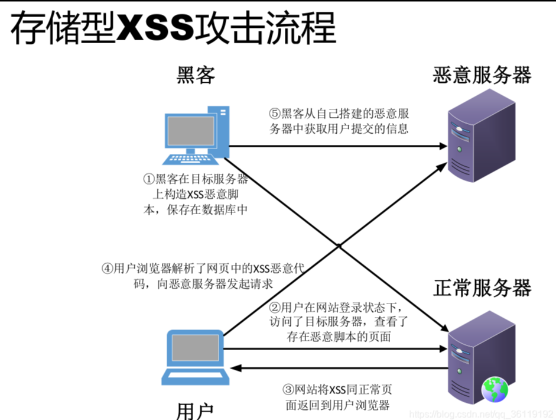
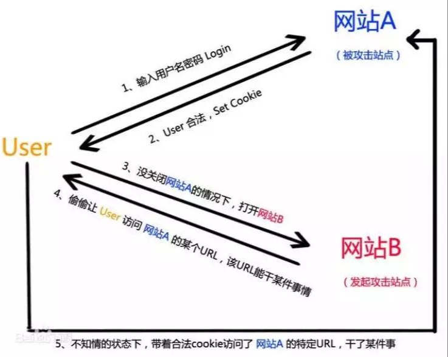
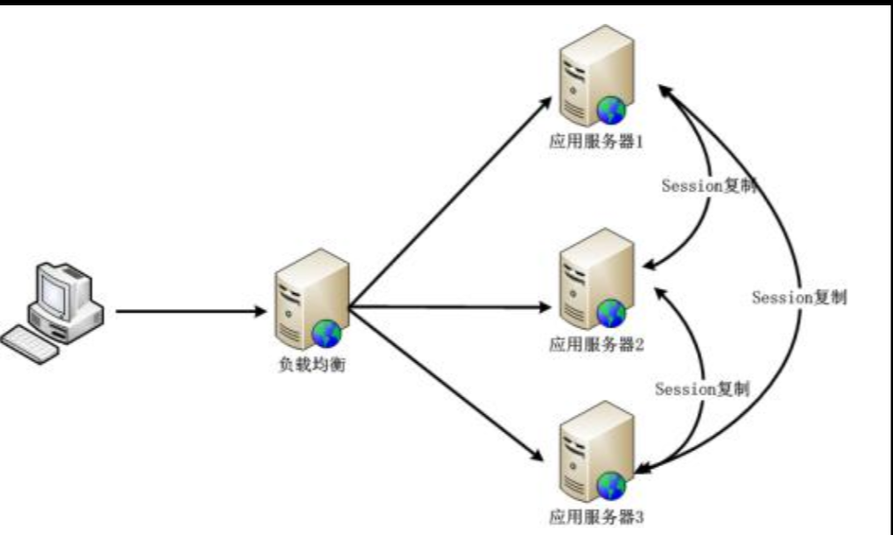
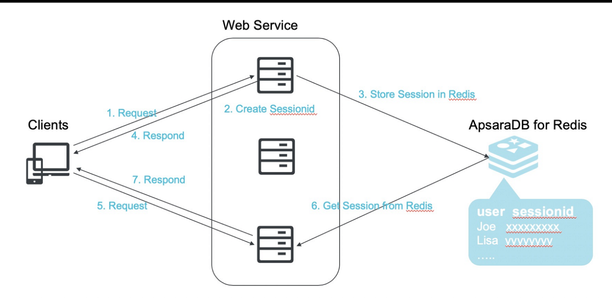
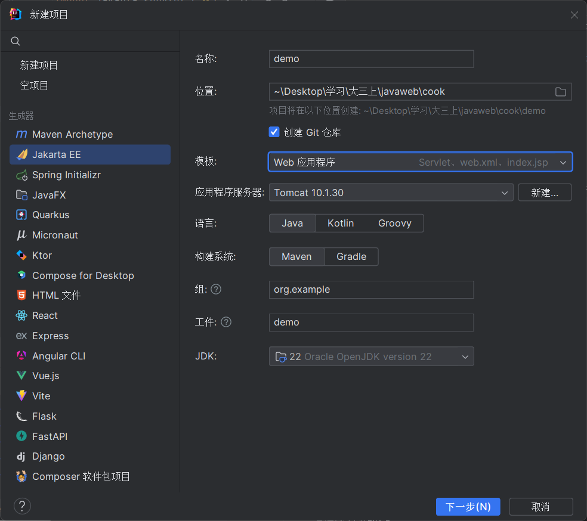
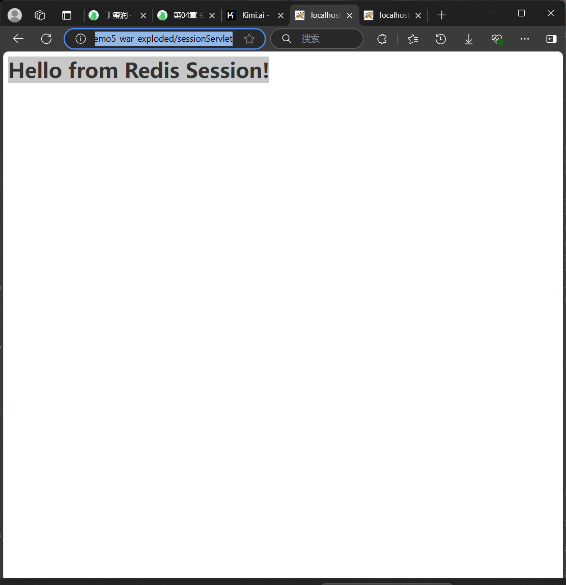
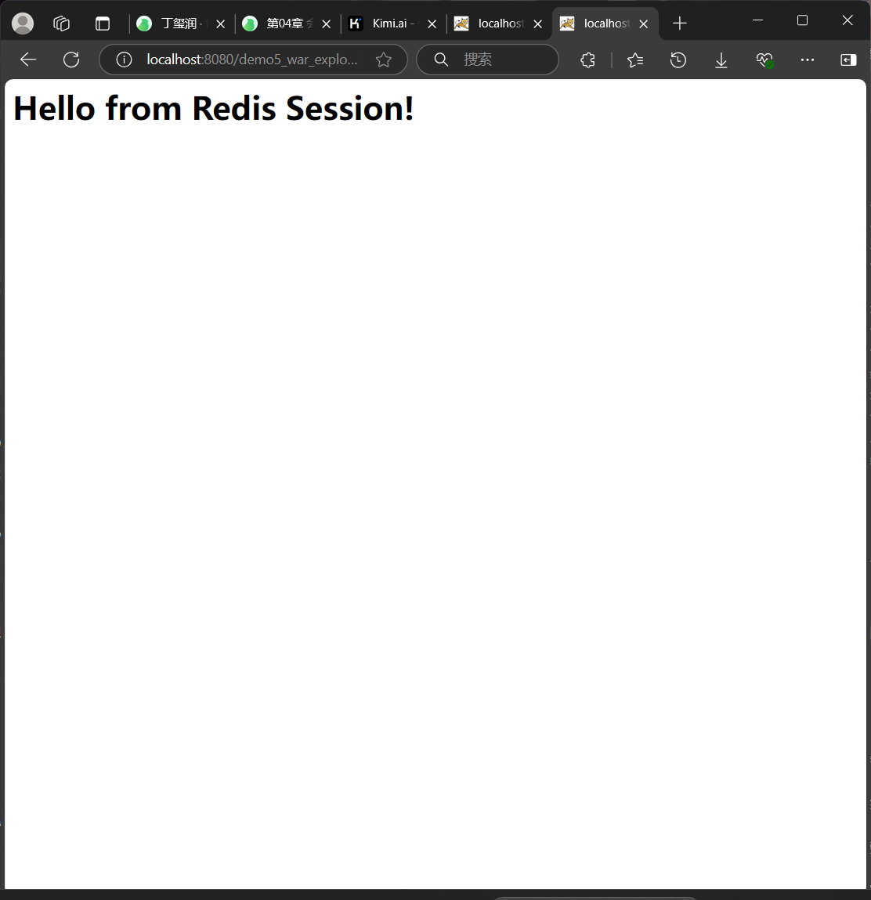

学院：省级示范性软件学院

题目：《 作业一：会话》

姓名：焦买涛

学号：2200770114

班级：软工2203

日期：2024-9-24


***
# 扩展内容(作业)
正文
1. 会话安全性

   ● 会话劫持和防御

   会话劫持（Session Hijacking）是一种网络攻击方式，攻击者通过某种手段获取到用户的会话标识（Session ID），然后使用这个会话标识冒充合法用户进行恶意操作。这种攻击方式允许攻击者以合法用户的身份访问受保护的资源，从而可能导致用户的隐私泄露、账户被盗、数据篡改等安全问题
   。
为了提高网络会话的安全性，所采取的例如使用HTTPS、设置HttpOnly属性等都是会话防御手段。


   ● 跨站脚本攻击（XSS）和防御


这个是攻击的流程图


跨站脚本攻击（XSS）是一种常见的网络安全漏洞，它允许攻击者将恶意脚本注入到网站页面中，当其他用户访问这些页面时，恶意脚本会在用户的浏览器上执行，可能导致信息窃取、账户劫持、网站篡改等安全问题
。

XSS攻击主要分为三类：

1.存储型XSS：攻击脚本存储在目标服务器的数据库中，当用户访问特定页面时，脚本自动执行。

2.反射型XSS：攻击脚本存在于URL中，用户点击恶意链接后，服务器将恶意脚本反射回用户浏览器执行。

3.DOM型XSS：攻击基于客户端DOM解析错误，不需要服务器参与，攻击脚本通过修改页面的DOM结构来触发漏洞。

防御XSS攻击的措施

1.输入验证与过滤：对用户输入的数据进行严格的验证和过滤，拒绝或过滤掉含有潜在危险字符的输入。

2.输出编码：在将数据输出到HTML、JavaScript、CSS或URL中时，进行适当的编码，以防止恶意脚本的执行。

3.启用内容安全政策（CSP）：通过设置CSP响应头，限制网页上能执行的脚本和加载的资源，有助于阻止恶意脚本的执行。

4.使用安全库和框架：利用现代Web开发框架提供的安全特性，如自动转义输出、防止跨站请求伪造（CSRF）等。

5.定期审计与测试：进行定期的代码审查和安全测试，以发现和修复潜在的XSS漏洞。


   ● 跨站请求伪造（CSRF）和防御



跨站请求伪造（CSRF）是一种网络安全攻击，攻击者通过诱导用户在已认证的Web应用程序上执行非本意的操作，如转账、修改密码等。这种攻击利用了用户浏览器中保存的认证凭据（如Cookie、Session等），在用户不知情的情况下，向受信任的网站发送恶意请求。

CSRF攻击的工作原理：

1.用户登录受信任网站A，并保持登录状态。

2.用户访问恶意网站B，该网站包含针对网站A的恶意请求。

3.恶意请求自动携带用户在网站A的认证信息（如Cookie）。

4.网站A接收到请求，并误以为是用户本人的操作，执行相应的动作。


***
2. 分布式会话管理



   ● 分布式环境下的会话同步问题

在分布式环境下，会话同步问题是一个挑战，因为不同的服务器可能无法访问彼此的本地会话存储。


   ● Session集群解决方案

1.Session复制：每个服务器都存储所有用户的Session信息，任何服务器都可以处理任何用户的请求。这种方法的缺点是同步延迟和资源消耗较大。

2.Session粘滞性（Sticky Sessions）：通过负载均衡器的配置，确保用户的请求总是被发送到同一个服务器。这种方法的缺点是限制了负载均衡的能力，并且如果服务器宕机，Session会丢失。

3.使用中央存储：如数据库或缓存系统（例如Redis、Memcached）来存储Session数据，所有服务器都可以访问这个中央存储来获取Session信息。这种方法的优点是它可以提供高可用性和可扩展性。

4.Spring Session：Spring框架提供了一个扩展，Spring Session，它支持使用外部存储来管理Session，如Redis。Spring Session可以与Spring Boot一起使用，提供无状态的Session管理
。

5.Token-based Authentication：使用Token（如JWT）来代替传统的Session管理，Token可以在客户端存储，并且每次请求都会发送到服务器进行验证。

6.Cookie存储Session：将Session数据加密后存储在Cookie中，这样任何服务器都可以读取Cookie来获取Session信息。这种方法的缺点是安全性较低，并且Cookie的大小有限制。

7.基于Nginx的ip_hash特性：Nginx可以将来自同一IP地址的请求分发到同一台服务器，从而实现Session的持久化。

8.自定义Session管理：开发者可以自己实现Session管理，将Session数据存储在中央数据库或缓存系统中。


  ● 使用Redis等缓存技术实现分布式会话



1.高性能：Redis是一个高性能的键值存储系统，可以快速读写会话数据。

2.内存存储：会话数据存储在Redis的内存中，访问速度快。

3.分布式支持：Redis支持分布式部署，可以无缝集成到集群环境中。

4.安全性：会话数据存储在服务器端，比客户端Cookie存储更安全。

现在开始代码事例

先新建一个Javaee项目


然后新建src/main/java/org/example/demo5/SessionConfig.java

```java
package org.example.demo5;

import org.springframework.context.annotation.Configuration;
import org.springframework.session.data.redis.config.annotation.web.http.EnableRedisHttpSession;

@Configuration
@EnableRedisHttpSession
public class SessionConfig {
}

```

再建立src/main/java/org/example/demo5/SessionServlet.java

```java
package org.example.demo5;

import jakarta.servlet.ServletException;
import jakarta.servlet.http.HttpServlet;
import jakarta.servlet.http.HttpServletRequest;
import jakarta.servlet.http.HttpServletResponse;
import java.io.IOException;
import java.io.PrintWriter;

public class SessionServlet extends HttpServlet {

    @Override
    protected void doGet(HttpServletRequest req, HttpServletResponse resp) throws ServletException, IOException {
        req.getSession().setAttribute("message", "Hello from Redis Session!");
        resp.setContentType("text/html");
        PrintWriter out = resp.getWriter();
        out.println("<html><body>");
        out.println("<h1>" + req.getSession().getAttribute("message") + "</h1>");
        out.println("</body></html>");
    }
}

```

配置应用程序以使用Redis：
src/main/resources/application.properties
```
spring.redis.host=localhost
spring.redis.port=6379
# 如果您的Redis设置了密码
# spring.redis.password=yourpassword

```

配置web.xml
```
<web-app xmlns="http://xmlns.jcp.org/xml/ns/javaee"
         xmlns:xsi="http://www.w3.org/2001/XMLSchema-instance"
         xsi:schemaLocation="http://xmlns.jcp.org/xml/ns/javaee http://xmlns.jcp.org/xml/ns/javaee/web-app_3_1.xsd"
         version="3.1">

    <servlet>
        <servlet-name>SessionServlet</servlet-name>
        <servlet-class>org.example.demo5.SessionServlet</servlet-class>
    </servlet>
    <servlet-mapping>
        <servlet-name>SessionServlet</servlet-name>
        <url-pattern>/sessionServlet</url-pattern>
    </servlet-mapping>
</web-app>

```

刷新maven后访问http://localhost:8080/demo5_war_exploded/sessionServlet






说明成功分布式会话完成。

***

3. 会话状态的序列化和反序列化

   ● 会话状态的序列化和反序列化

序列化（Serialization）

序列化是将数据结构或对象状态转换成可存储或可传输的格式的过程。序列化后的数据可以保存到文件、数据库或通过网络传输。

序列化的过程通常包括：

1. 确定需要序列化的数据   

2. 将数据转换为一种格式（如JSON、XML等）。

3. 将转换后的数据写入文件或通过网络发送。

反序列化（Deserialization）

反序列化的过程通常包括：

反序列化是序列化的逆过程，它将序列化后的数据重新转换为原始的数据结构或对象状态。

1. 从文件、数据库或网络接收序列化的数据。

2. 解析数据，将其转换回原始的数据结构或对象。

3. 使用转换后的数据进行进一步的操作。


   ● 为什么需要序列化会话状态

持久化存储：在Web应用程序中，用户会话通常需要在服务器重启后仍然可用。序列化会话状态允许将这些状态存储在数据库或文件系统中，以便在需要时恢复。

跨多个请求保持状态：Web服务器通常处理多个并发请求，并且每个请求可能由不同的服务器实例处理。序列化会话状态使得可以在多个请求之间保持用户的会话信息。

负载均衡：在分布式系统中，负载均衡器可能会将用户的请求分发到不同的服务器。序列化会话状态允许用户在不同的服务器之间切换时保持会话的一致性。

安全性：通过序列化会话状态，可以对会话数据进行加密，以防止敏感信息在传输过程中被窃取。

可伸缩性：在分布式系统中，会话状态的序列化允许会话数据在不同的服务器之间共享，从而提高系统的可伸缩性。

容错性：序列化会话状态可以提高系统的容错性。如果一个服务器实例失败，会话数据可以从其他服务器或存储系统中恢复。

异步处理：在处理异步请求时，序列化会话状态可以确保在不同的处理阶段之间正确地传递用户信息。

简化开发：序列化会话状态简化了开发过程，因为开发者不需要关心会话数据如何在不同的服务器或服务之间共享。

兼容性：序列化会话状态使得会话数据可以在不同的平台和环境中使用，提高了应用程序的兼容性。

审计和监控：序列化会话状态可以用于审计和监控目的，帮助跟踪用户活动和系统性能。

   ● Java对象序列化

在Java中，对象序列化是一个非常重要的特性，它允许我们将对象的状态保存到一个序列化的流中，然后可以将其存储到文件系统或通过网络传输。序列化对象的类需要实现java.io.Serializable接口，这个接口是一个标记接口，不包含任何方法，但是它告诉Java虚拟机（JVM）该类的对象可以被序列化
。

```java
import java.io.*;

public class SerializationExample {
    public static void main(String[] args) {
        Employee employee = new Employee(1, "John Doe", "Development");
        
        try {
            // 序列化对象到文件
            FileOutputStream fileOut = new FileOutputStream("employee.ser");
            ObjectOutputStream out = new ObjectOutputStream(fileOut);
            out.writeObject(employee);
            out.close();
            fileOut.close();
            
            // 从文件反序列化对象
            FileInputStream fileIn = new FileInputStream("employee.ser");
            ObjectInputStream in = new ObjectInputStream(fileIn);
            Employee employeeCopy = (Employee) in.readObject();
            in.close();
            fileIn.close();
            
            System.out.println("Deserialized Employee: " + employeeCopy.getName());
        } catch (IOException i) {
            i.printStackTrace();
        } catch (ClassNotFoundException c) {
            System.out.println("Employee class not found.");
            c.printStackTrace();
        }
    }
}

class Employee implements Serializable {
    private static final long serialVersionUID = 1L;
    private int id;
    private String name;
    private String department;

    // Constructor, Getters, Setters
}

```
Employee类实现了Serializable接口，这样就可以使用ObjectOutputStream将其实例序列化到文件中。然后可以使用ObjectInputStream从文件中反序列化对象。
  
 ● 自定义序列化策略

1. 实现Externalizable接口
   Externalizable接口是Serializable接口的子接口，它提供了更细粒度的控制，允许你自定义对象的序列化和反序列化过程。实现Externalizable接口的类必须实现writeExternal和readExternal方法。

```java
import java.io.Externalizable;
import java.io.ObjectInput;
import java.io.ObjectOutput;

public class Employee implements Externalizable {
    private int id;
    private String name;
    private String department;

    public Employee() {
        // 无参数构造函数
    }

    public Employee(int id, String name, String department) {
        this.id = id;
        this.name = name;
        this.department = department;
    }

    public void writeExternal(ObjectOutput out) throws IOException {
        out.writeInt(id);
        out.writeObject(name);
        out.writeObject(department);
    }

    public void readExternal(ObjectInput in) throws IOException, ClassNotFoundException {
        id = in.readInt();
        name = (String) in.readObject();
        department = (String) in.readObject();
    }

    // Getters and Setters
}

```


2. 自定义writeObject和readObject方法

```java
import java.io.*;

public class Employee implements Serializable {
    private int id;
    private String name;
    private transient String password; // 不序列化密码字段

    public Employee(int id, String name, String password) {
        this.id = id;
        this.name = name;
        this.password = password;
    }

    private void writeObject(ObjectOutputStream oos) throws IOException {
        oos.defaultWriteObject(); // 序列化非transient和非static字段
        oos.writeObject(password); // 显式序列化transient字段
    }

    private void readObject(ObjectInputStream ois) throws IOException, ClassNotFoundException {
        ois.defaultReadObject(); // 反序列化非transient和非static字段
        password = ois.readObject(); // 显式反序列化transient字段
    }

    // Getters and Setters
}
```


3. 使用serialPersistentFields

```java
import java.io.*;

public class Employee implements Serializable {
    private static final long serialVersionUID = 1L;

    private int id;
    private String name;
    private transient String password;

    private static final ObjectStreamField[] serialPersistentFields = {
        new ObjectStreamField("id", int.class),
        new ObjectStreamField("name", String.class),
        new ObjectStreamField("password", String.class)
    };

    public Employee(int id, String name, String password) {
        this.id = id;
        this.name = name;
        this.password = password;
    }

    private void writeObject(ObjectOutputStream oos) throws IOException {
        ObjectOutputStream.PutField fields = oos.putFields();
        fields.put("id", id);
        fields.put("name", name);
        fields.put("password", password);
        oos.writeFields();
    }

    private void readObject(ObjectInputStream ois) throws IOException, ClassNotFoundException {
        ObjectInputStream.GetField fields = ois.readFields();
        id = fields.get("id", -1); // 提供默认值
        name = (String) fields.get("name", null);
        password = (String) fields.get("password", null);
    }

    // Getters and Setters
}
```

4. 处理版本控制

```java
import java.io.*;

public class Employee implements Serializable {
    private static final long serialVersionUID = 1L; // 版本标识符

    private int id;
    private String name;
    private String department;

    // Constructor, Getters, Setters
}
```

问题：

在部署过程中因为操作不熟练，造成了许多不应该有的错误，但是后来都通过许多途径解决了，收获满满


注：

以上说法以及内容仅用于本人学习和成长，如有侵权联系删除，如有错误请见谅，欢迎讨论。


   截止日期 2024-09-30

