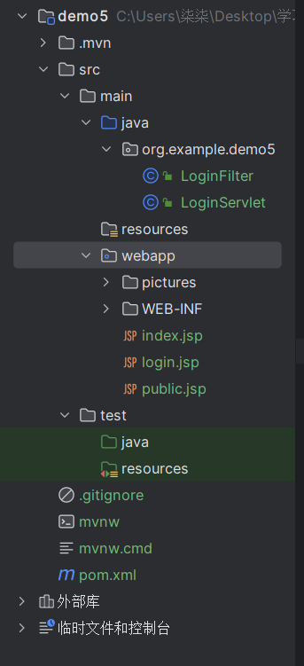
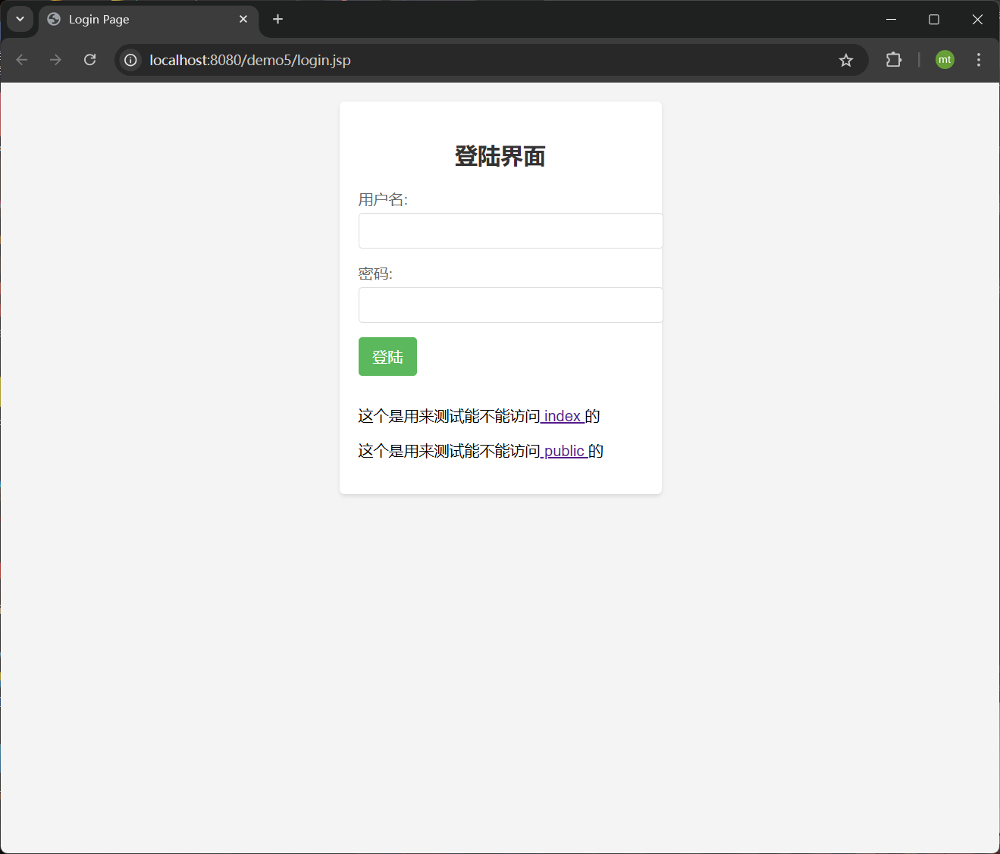
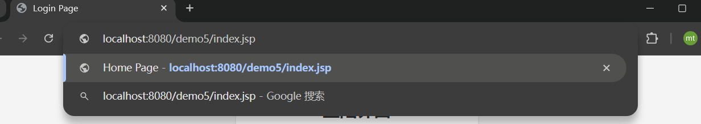
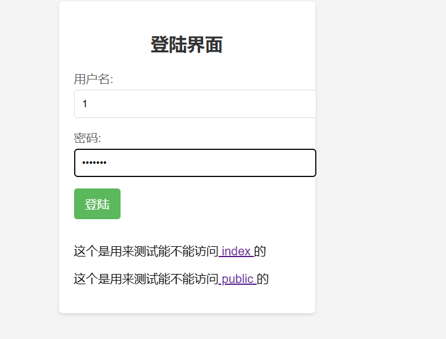
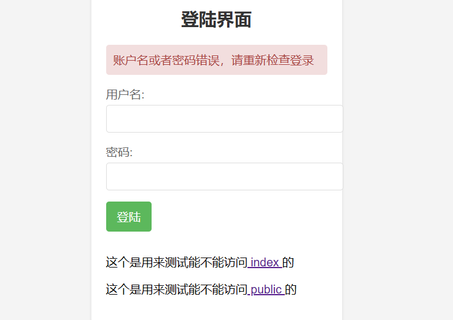
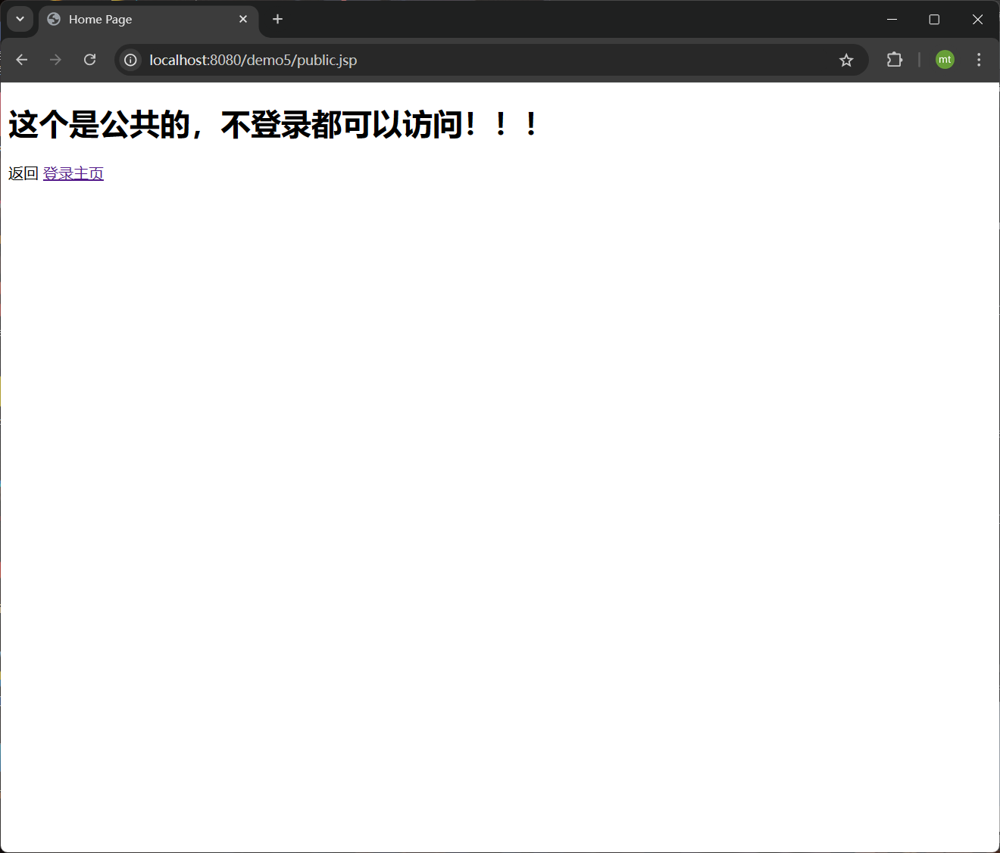
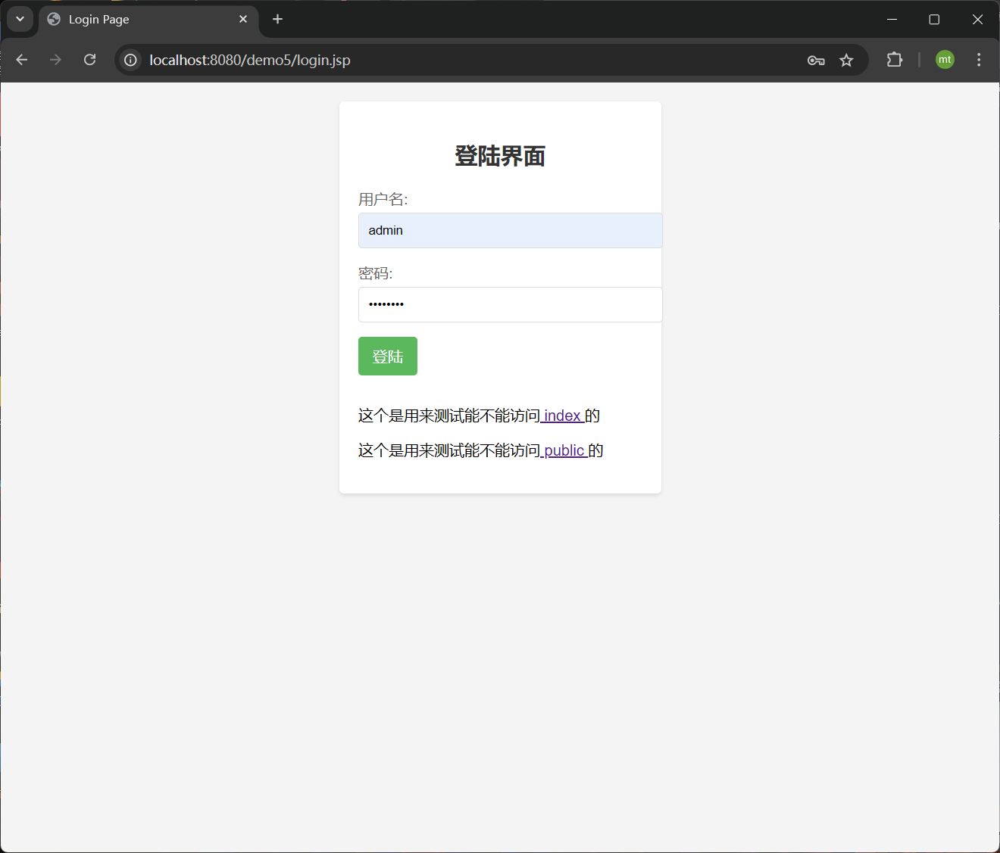

学院：省级示范性软件学院

题目：《 作业2： filter练习》

姓名：焦买涛

学号：2200770114

班级：软工2203

日期：2024-9-24


***


# filter练习

## 题目: 实现一个登录验证过滤器

目标: 创建一个 Servlet的 过滤器,用于验证用户是否已登录。对于未登录的用户,将其重定向到登录页面。

要求:

1. 创建一个名为 LoginFilter 的类, 实现 javax.servlet.Filter 接口。


2.使用 @WebFilter 注解配置过滤器,使其应用于所有 URL 路径 ("/*")。

3.在 doFilter 方法中实现以下逻辑:

   a. 检查当前请求是否是对登录页面、注册页面或公共资源的请求。如果是,则允许请求通过。

   b. 如果不是上述情况,检查用户的 session 中是否存在表示已登录的属性(如 "user" 属性)。
  
   c. 如果用户已登录,允许请求继续。
  
   d. 如果用户未登录,将请求重定向到登录页面。

4.创建一个排除列表,包含不需要登录就能访问的路径(如 "/login", "/register", "/public")。

5.实现一个方法来检查当前请求路径是否在排除列表中。

6.添加适当的注释,解释代码的主要部分。

***

### 1，创建基本项目目录

我们创建Javaee项目，下面给出目录情况



WEB-INF下面的jsp文件是我们所需要的网页界面，demo5下面是我们的servlet项目及filter过滤器，下面给出具体代码
LoginFilter.java

```java
package org.example.demo5;

import jakarta.servlet.*;
import jakarta.servlet.annotation.WebFilter;
import jakarta.servlet.http.HttpServletRequest;
import jakarta.servlet.http.HttpServletResponse;
import jakarta.servlet.http.HttpSession;

import java.io.IOException;
import java.util.Arrays;
import java.util.List;
import java.util.logging.Logger;

@WebFilter(urlPatterns = "/*") // 应用到所有URL路径
public class LoginFilter implements Filter {

   private List<String> excludePaths;
   private static final Logger LOGGER = Logger.getLogger(LoginFilter.class.getName());

   public void init(FilterConfig filterConfig) throws ServletException {
      // 初始化排除列表
      excludePaths = Arrays.asList("/login", "/login.jsp","/public.jsp","/pictures/*");
   }

   public void doFilter(ServletRequest request, ServletResponse response, FilterChain chain) throws IOException, ServletException {
      HttpServletRequest req = (HttpServletRequest) request;
      HttpServletResponse res = (HttpServletResponse) response;

      // 获取完整的请求路径
      String path = req.getRequestURI();
      String contextPath = req.getContextPath();

      // 检查当前请求路径是否在排除列表中
      if (isExcluded(path, contextPath)) {
         chain.doFilter(request, response);
      } else {
         HttpSession session = req.getSession(false);
         if (session != null && session.getAttribute("user") != null) {
            // 用户已登录，继续请求
            chain.doFilter(request, response);
         } else {
            // 用户未登录，重定向到登录页面
            res.sendRedirect(res.encodeRedirectURL(contextPath + "/login.jsp"));
         }
      }
   }
   public void destroy() {
      // 清理资源
   }

   private boolean isExcluded(String path, String contextPath) {
      // 检查当前请求路径是否在排除列表中
      return excludePaths.stream().anyMatch(p -> path.startsWith(contextPath + p));
   }
}
```

LoginServlet.java

```java
package org.example.demo5;

import jakarta.servlet.ServletException;
import jakarta.servlet.annotation.WebServlet;
import jakarta.servlet.http.HttpServlet;
import jakarta.servlet.http.HttpServletRequest;
import jakarta.servlet.http.HttpServletResponse;
import jakarta.servlet.http.HttpSession;

import java.io.IOException;

@WebServlet("/login")
public class LoginServlet extends HttpServlet {

    @Override
    protected void doPost(HttpServletRequest request, HttpServletResponse response) throws ServletException, IOException {
        // 获取表单数据
        String username = request.getParameter("j_username");
        String password = request.getParameter("j_password");

        // 登录验证逻辑
        if ("admin".equals(username) && "password".equals(password)) {
            // 登录成功，将用户信息存储在session中
            HttpSession session = request.getSession();
            session.setAttribute("user", username);

            // 重定向到受保护的页面（例如 index.jsp）
            response.sendRedirect(request.getContextPath() + "/index.jsp");
        } else {
            // 登录失败，设置错误消息
            request.setAttribute("errorMessage", "账户名或者密码错误，请重新检查登录");
            // 转发回登录页面，显示错误消息
            request.getRequestDispatcher("/login.jsp").forward(request, response);
        }
    }

    @Override
    protected void doGet(HttpServletRequest request, HttpServletResponse response) throws ServletException, IOException {
        // 对于GET请求，转发到登录页面
        request.getRequestDispatcher("/login.jsp").forward(request, response);
    }
}
```


jsp网页

index.jsp
```jsp
<%@ page contentType="text/html; charset=UTF-8" pageEncoding="UTF-8" %>
<!DOCTYPE html>
<html>
<head>
    <title>Home Page</title>
    <style>
        body {
            background-image: url('pictures/img.png');
            background-repeat: repeat;
            background-size: 500px,500px;
            background-position: center;

        }
    </style>


</head>
<body>
<h1>恭喜你来到主页！！！</h1>

<p>回到 <a href="login.jsp">登录主页</a></p>
</body>
</html>
```

login.jsp
```jsp-
<%@ page contentType="text/html; charset=UTF-8" pageEncoding="UTF-8" %>
<!DOCTYPE html>
<html>
<head>
    <title>Login Page</title>
    <style>
        body {
            font-family: Arial, sans-serif;
            background-color: #f4f4f4;
            margin: 0;
            padding: 20px;

        }
        .login-container {
            max-width: 300px;
            margin: 0 auto;
            background: #fff;
            padding: 20px;
            border-radius: 5px;
            box-shadow: 0 2px 4px rgba(0, 0, 0, 0.1);
        }
        h2 {
            text-align: center;
            color: #333;
        }
        form {
            display: flex;
            flex-direction: column;
        }
        form div {
            margin-bottom: 15px;
        }
        label {
            display: block;
            margin-bottom: 5px;
            color: #666;
        }
        input[type="text"],
        input[type="password"] {
            width: 100%;
            padding: 10px;
            border: 1px solid #ddd;
            border-radius: 4px;
        }
        button {
            background-color: #5cb85c;
            color: white;
            padding: 10px 15px;
            border: none;
            border-radius: 4px;
            cursor: pointer;
            font-size: 16px;
        }
        button:hover {
            background-color: #4cae4c;
        }
        .error-message {
            background-color: #f2dede;
            color: #a94442;
            padding: 10px;
            border-radius: 4px;
            margin-bottom: 15px;
        }
    </style>
</head>
<body>
<div class="login-container">
    <h2>登陆界面</h2>
    <% if (request.getAttribute("errorMessage") != null) { %>
    <p class="error-message"><%= request.getAttribute("errorMessage") %></p>
    <% } %>
    <form action="login" method="post">
        <div>
            <label for="j_username">用户名:</label>
            <input type="text" id="j_username" name="j_username" required>
        </div>
        <div>
            <label for="j_password">密码:</label>
            <input type="password" id="j_password" name="j_password" required>
        </div>
        <div>
            <button type="submit">登陆</button>
        </div>
    </form>

    <p>这个是用来测试能不能访问<a href="index.jsp"> index  </a>的</p>
    <p>这个是用来测试能不能访问<a href="public.jsp"> public </a>的</p>

</div>


<div>

</div>
</body>
</html>


```


public.jsp
```
<%@ page contentType="text/html; charset=UTF-8" pageEncoding="UTF-8" %>
<!DOCTYPE html>
<html>
<head>
    <title>Home Page</title>
    <style>
        body {
            background-image: url('pictures/img_1.png');
            background-repeat: repeat;
            background-size: 300px,300px;
            background-position: center;

        }
    </style>


</head>
<body>
<h1>这个是公共的，不登录都可以访问！！！</h1>

<p>返回 <a href="login.jsp">登录主页</a> </p>


</body>
</html>


```


### 2.功能验证

启动时在该主登陆页面


接下来我们尝试在未登录状态下访问index



发现重定向到login,说明重定向成功，cookie中没有我们的登陆信息所以重定向到登录页面，不允许访问index页面。

接下来测试输入错误的账户密码（我代码中设置的账户密码为admin  password）



显然登陆失败，给出提示并重定向到登录界面



我们再继续访问public显示成功，没有重定向回登录页面，因为public在过滤器排除路径里，不登录也允以访问



接下来进行正确登录（admin password）



显示来到主页index，说明登陆成功。


此时浏览器cookie已经记录我们的登录信息，我们新开一个标签尝试访问index


显然也是访问成功，说明功能实现。


***

收获：我懂得了cookie如何与服务器端进行交互，知道了filter过滤器的作用，以及怎么使用filter，总之收获满满。


*** 

注意：本文仅用于记录本人的学习历程，如果有不正确的地方请允以包函和指正，谢谢观看！


