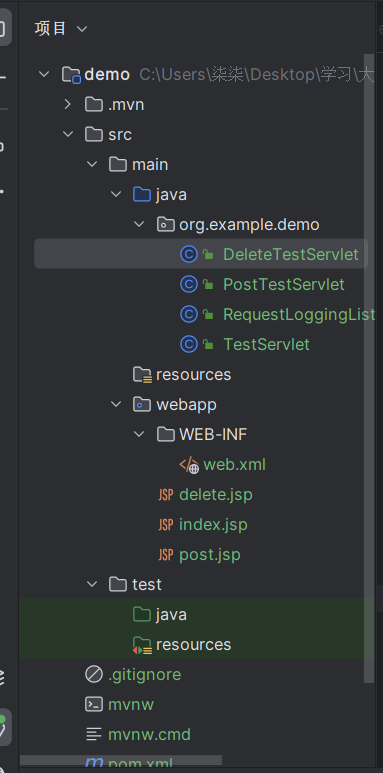
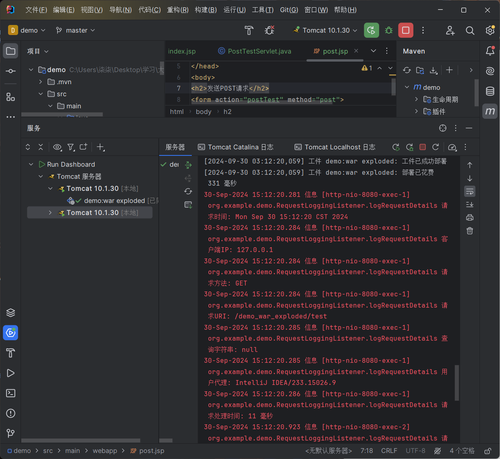
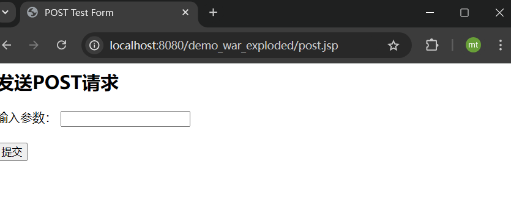
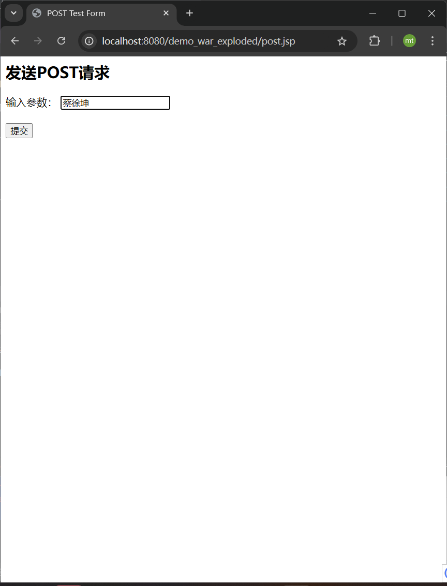
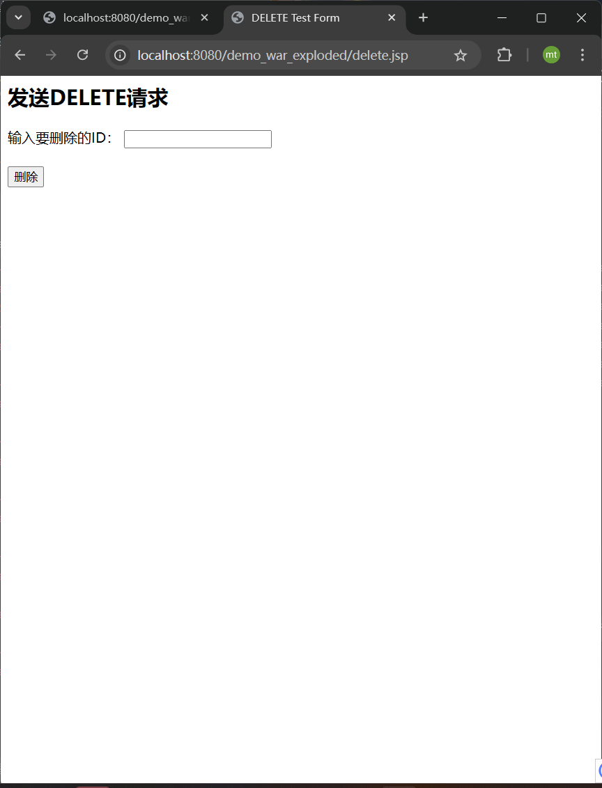
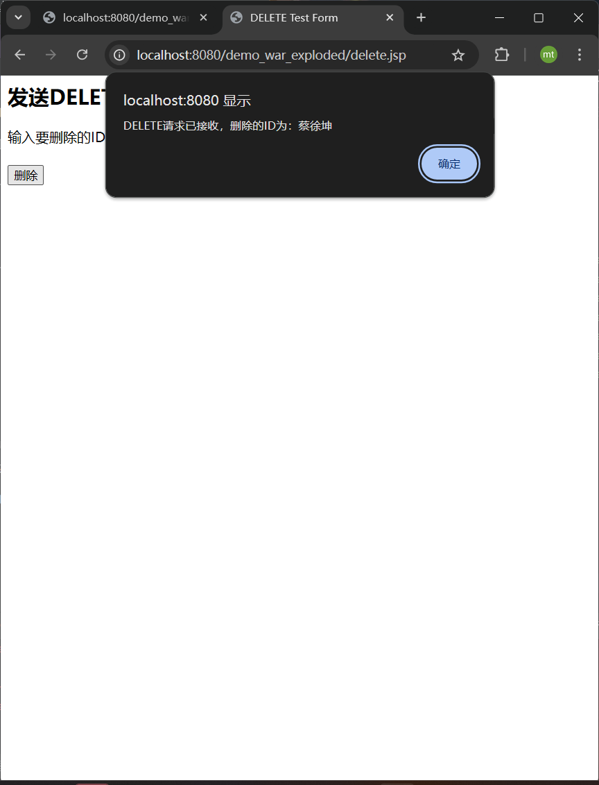

学院：省级示范性软件学院

题目：《 作业2： listener练习》

姓名：焦买涛

学号：2200770114

班级：软工2203

日期：2024-9-30


***

# listener练习

题目：完成请求日志记录（ServletRequestListener）功能

要求：


1. 实现一个 ServletRequestListener 来记录每个 HTTP 请求的详细信息。


2. 记录的信息应包括但不限于：


   ○ 请求时间

   ○ 客户端 IP 地址

   ○ 请求方法（GET, POST 等）

   ○ 请求 URI

   ○ 查询字符串（如果有）

   ○ User-Agent

   ○ 请求处理时间（从请求开始到结束的时间）

3. 在请求开始时记录开始时间，在请求结束时计算处理时间。

4. 使用适当的日志格式，确保日志易于阅读和分析。

5. 实现一个简单的测试 Servlet，用于验证日志记录功能。

6. 提供简要说明，解释你的实现方式和任何需要注意的事项。


***

### 一、代码构建

1，给出我的项目结构



我们是基于ja kart ee项目结构添加的servlet类和test类用于处理最基本的get、post、delete请求的日志记录（由于delete不会直接记录，所以我们用post来模拟）

2.代码内容

DeleteTestServlet.java
```java
package org.example.demo;

import jakarta.servlet.ServletException;
import jakarta.servlet.annotation.WebServlet;
import jakarta.servlet.http.HttpServlet;
import jakarta.servlet.http.HttpServletRequest;
import jakarta.servlet.http.HttpServletResponse;
import java.io.IOException;
import java.io.PrintWriter;

@WebServlet("/deleteTest")
public class DeleteTestServlet extends HttpServlet {

    @Override
    protected void doDelete(HttpServletRequest request, HttpServletResponse response) throws ServletException, IOException {
        // 设置响应内容类型
        response.setContentType("text/html;charset=UTF-8");

        // 获取请求参数
        String id = request.getParameter("id");

        // 响应发送HTML内容
        PrintWriter out = response.getWriter();
        out.println("<h1>DELETE请求已接收</h1>");
        out.println("<p>删除的ID为：" + id + "</p>");
    }

    @Override
    protected void doPost(HttpServletRequest request, HttpServletResponse response) throws ServletException, IOException {
        // 检查是否为模拟的DELETE请求
        String method = request.getHeader("X-HTTP-Method-Override");
        if ("DELETE".equals(method)) {
            // 处理DELETE请求
            doDelete(request, response);
        } else {
            // 处理普通的POST请求（重定向到表单页面）
            doGet(request, response);
        }
    }

    @Override
    protected void doGet(HttpServletRequest request, HttpServletResponse response) throws ServletException, IOException {
        // 重定向到表单页面
        response.sendRedirect("deleteTestForm.jsp");
    }
}


```


PostTestServlet.java
```java
package org.example.demo;

import jakarta.servlet.ServletException;
import jakarta.servlet.annotation.WebServlet;
import jakarta.servlet.http.HttpServlet;
import jakarta.servlet.http.HttpServletRequest;
import jakarta.servlet.http.HttpServletResponse;
import java.io.IOException;
import java.io.PrintWriter;

@WebServlet("/postTest")
public class PostTestServlet extends HttpServlet {

    @Override
    protected void doPost(HttpServletRequest request, HttpServletResponse response) throws ServletException, IOException {
        // 设置响应内容类型
        response.setContentType("text/html;charset=UTF-8");

        // 获取请求参数
        String paramValue = request.getParameter("param");

        // 响应发送HTML内容
        PrintWriter out = response.getWriter();
        out.println("<h1>POST请求已接收</h1>");
        out.println("<p>参数值为：" + paramValue + "</p>");
    }

    @Override
    protected void doGet(HttpServletRequest request, HttpServletResponse response) throws ServletException, IOException {
        // 重定向到表单页面
        response.sendRedirect("postTestForm.jsp");
    }
}
```

RequestLoggingListener.java
```java

package org.example.demo;

import jakarta.servlet.ServletRequestEvent;
import jakarta.servlet.ServletRequestListener;
import jakarta.servlet.annotation.WebListener;
import jakarta.servlet.http.HttpServletRequest;
import java.util.logging.Logger;

// 使用@WebListener注解标注该类为一个ServletContext监听器
@WebListener
public class RequestLoggingListener implements ServletRequestListener {

    // 创建一个Logger对象用于记录日志信息
    private static final Logger LOGGER = Logger.getLogger(RequestLoggingListener.class.getName());

    // 当ServletRequest事件发生时，这个方法会被调用
    @Override
    public void requestInitialized(ServletRequestEvent sre) {
        // 从事件对象中获取HttpServletRequest对象
        HttpServletRequest request = (HttpServletRequest) sre.getServletRequest();
        // 记录请求开始的时间，并将其存储在请求属性中
        request.setAttribute("startTime", System.currentTimeMillis());
    }

    // 当ServletRequest事件结束时，这个方法会被调用
    @Override
    public void requestDestroyed(ServletRequestEvent sre) {
        // 从事件对象中获取HttpServletRequest对象
        HttpServletRequest request = (HttpServletRequest) sre.getServletRequest();
        // 从请求属性中获取之前存储的开始时间
        long startTime = (Long) request.getAttribute("startTime");
        // 计算请求处理的持续时间
        long duration = System.currentTimeMillis() - startTime;

        // 调用logRequestDetails方法记录请求的详细信息
        logRequestDetails(request, duration);
    }

    // 定义一个私有方法用于记录请求的详细信息
    private void logRequestDetails(HttpServletRequest request, long duration) {
        // 获取客户端的IP地址
        String clientIp = request.getRemoteAddr();
        // 获取请求的方法（如GET或POST）
        String requestMethod = request.getMethod();
        // 获取请求的URI
        String requestUri = request.getRequestURI();
        // 获取请求的查询字符串
        String queryString = request.getQueryString();
        // 获取请求的用户代理信息
        String userAgent = request.getHeader("User-Agent");

        // 记录请求发生的时间
        LOGGER.info(() -> "请求时间: " + new java.util.Date());
        // 记录客户端IP地址
        LOGGER.info(() -> "客户端IP: " + clientIp);
        // 记录请求方法
        LOGGER.info(() -> "请求方法: " + requestMethod);
        // 记录请求URI
        LOGGER.info(() -> "请求URI: " + requestUri);
        // 记录查询字符串
        LOGGER.info(() -> "查询字符串: " + queryString);
        // 记录用户代理信息
        LOGGER.info(() -> "用户代理: " + userAgent);
        // 记录请求的处理时间
        LOGGER.info(() -> "请求处理时间: " + duration + " 毫秒");
    }
}
```
TestServlet.java

```java
package org.example.demo;

import jakarta.servlet.ServletException;
import jakarta.servlet.annotation.WebServlet;
import jakarta.servlet.http.HttpServlet;
import jakarta.servlet.http.HttpServletRequest;
import jakarta.servlet.http.HttpServletResponse;
import java.io.IOException;
import java.io.PrintWriter;

@WebServlet("/test")
public class TestServlet extends HttpServlet {

    @Override
    protected void doGet(HttpServletRequest request, HttpServletResponse response) throws ServletException, IOException {
        response.setContentType("text/html");
        PrintWriter out = response.getWriter();
        out.println("<h1>Hello, World!</h1>");
    }
}
```
delete.jsp
```jsp
<%@ page contentType="text/html;charset=UTF-8" language="java" %>
<html>
<head>
    <title>DELETE Test Form</title>
    <script>
        function sendDeleteRequest() {
            var id = document.getElementById('id').value;
            var xhr = new XMLHttpRequest();
            xhr.open('POST', 'deleteTest', true);
            xhr.setRequestHeader('X-HTTP-Method-Override', 'DELETE');
            xhr.setRequestHeader('Content-Type', 'application/x-www-form-urlencoded');
            xhr.onload = function () {
                if (xhr.status >= 200 && xhr.status < 300) {
                    alert('DELETE请求已接收，删除的ID为：' + id);
                } else {
                    alert('请求失败');
                }
            };
            xhr.send('id=' + encodeURIComponent(id));
            return false; // 阻止表单的默认提交行为
        }
    </script>
</head>
<body>
<h2>发送DELETE请求</h2>
<form onsubmit="return sendDeleteRequest();">
    <label for="id">输入要删除的ID：</label>
    <input type="text" id="id" name="id"><br><br>
    <input type="submit" value="删除">
</form>
</body>
</html>

```

index.jsp
```jsp

<%@ page contentType="text/html;charset=UTF-8" language="java" %>
<html>
<head>
    <title>JSP首页</title>
</head>
<body>
<h1>欢迎来到我的JSP页面</h1>
<p>当前时间是: <%= new java.util.Date() %></p>
</body>
</html>
```
post.jsp

```jsp

<%@ page contentType="text/html;charset=UTF-8" language="java" %>
<html>
<head>
    <title>POST Test Form</title>
</head>
<body>
<h2>发送POST请求</h2>
<form action="postTest" method="post">
    <label for="param">输入参数：</label>
    <input type="text" id="param" name="param"><br><br>
    <input type="submit" value="提交">
</form>
</body>
</html>

```


*** 

### 二、功能验证

1.启动服务区

浏览器界面


2.查看输出日志

输出日志


```
C:\Users\柒柒\Desktop\学习\大三上\javaweb\apache-tomcat-10.1.30\bin\catalina.bat run
[2024-09-30 03:12:18,125] 工件 demo:war exploded: 正在等待服务器连接以启动工件部署…
Using CATALINA_BASE:   "C:\Users\柒柒\AppData\Local\JetBrains\IntelliJIdea2023.3\tomcat\d9688ddc-e1af-4fe4-81e1-762f2016aa29"
Using CATALINA_HOME:   "C:\Users\柒柒\Desktop\学习\大三上\javaweb\apache-tomcat-10.1.30"
Using CATALINA_TMPDIR: "C:\Users\柒柒\Desktop\学习\大三上\javaweb\apache-tomcat-10.1.30\temp"
Using JRE_HOME:        "C:\Program Files\Java\jdk-22"
Using CLASSPATH:       "C:\Users\柒柒\Desktop\学习\大三上\javaweb\apache-tomcat-10.1.30\bin\bootstrap.jar;C:\Users\柒柒\Desktop\学习\大三上\javaweb\apache-tomcat-10.1.30\bin\tomcat-juli.jar"
Using CATALINA_OPTS:   ""
30-Sep-2024 15:12:18.623 警告 [main] org.apache.catalina.startup.ClassLoaderFactory.validateFile Problem with directory [C:\Users\??????\Desktop\??????\?¤§??????\javaweb\apache-tomcat-10.1.30\lib], exists: [false], isDirectory: [false], canRead: [false]
30-Sep-2024 15:12:18.628 警告 [main] org.apache.catalina.startup.ClassLoaderFactory.validateFile Problem with directory [C:\Users\??????\Desktop\??????\?¤§??????\javaweb\apache-tomcat-10.1.30\lib], exists: [false], isDirectory: [false], canRead: [false]
30-Sep-2024 15:12:18.994 信息 [main] org.apache.catalina.startup.VersionLoggerListener.log Server.服务器版本: Apache Tomcat/10.1.30
30-Sep-2024 15:12:18.995 信息 [main] org.apache.catalina.startup.VersionLoggerListener.log 服务器构建:        Sep 13 2024 20:26:16 UTC
30-Sep-2024 15:12:18.995 信息 [main] org.apache.catalina.startup.VersionLoggerListener.log 服务器版本号:      10.1.30.0
30-Sep-2024 15:12:18.995 信息 [main] org.apache.catalina.startup.VersionLoggerListener.log 操作系统名称:      Windows 11
30-Sep-2024 15:12:18.995 信息 [main] org.apache.catalina.startup.VersionLoggerListener.log OS.版本:           10.0
30-Sep-2024 15:12:18.995 信息 [main] org.apache.catalina.startup.VersionLoggerListener.log 架构:              amd64
30-Sep-2024 15:12:18.995 信息 [main] org.apache.catalina.startup.VersionLoggerListener.log Java 环境变量:     C:\Program Files\Java\jdk-22
30-Sep-2024 15:12:18.996 信息 [main] org.apache.catalina.startup.VersionLoggerListener.log Java虚拟机版本:    22+36-2370
30-Sep-2024 15:12:18.996 信息 [main] org.apache.catalina.startup.VersionLoggerListener.log JVM.供应商:        Oracle Corporation
30-Sep-2024 15:12:18.996 信息 [main] org.apache.catalina.startup.VersionLoggerListener.log CATALINA_BASE:     C:\Users\柒柒\AppData\Local\JetBrains\IntelliJIdea2023.3\tomcat\d9688ddc-e1af-4fe4-81e1-762f2016aa29
30-Sep-2024 15:12:18.996 信息 [main] org.apache.catalina.startup.VersionLoggerListener.log CATALINA_HOME:     C:\Users\柒柒\Desktop\学习\大三上\javaweb\apache-tomcat-10.1.30
30-Sep-2024 15:12:18.996 信息 [main] org.apache.catalina.startup.VersionLoggerListener.log 命令行参数：       -Djava.util.logging.config.file=C:\Users\柒柒\AppData\Local\JetBrains\IntelliJIdea2023.3\tomcat\d9688ddc-e1af-4fe4-81e1-762f2016aa29\conf\logging.properties
30-Sep-2024 15:12:18.997 信息 [main] org.apache.catalina.startup.VersionLoggerListener.log 命令行参数：       -Djava.util.logging.manager=org.apache.juli.ClassLoaderLogManager
30-Sep-2024 15:12:18.997 信息 [main] org.apache.catalina.startup.VersionLoggerListener.log 命令行参数：       -Dcom.sun.management.jmxremote=
30-Sep-2024 15:12:18.997 信息 [main] org.apache.catalina.startup.VersionLoggerListener.log 命令行参数：       -Dcom.sun.management.jmxremote.port=1099
30-Sep-2024 15:12:18.997 信息 [main] org.apache.catalina.startup.VersionLoggerListener.log 命令行参数：       -Dcom.sun.management.jmxremote.ssl=false
30-Sep-2024 15:12:18.997 信息 [main] org.apache.catalina.startup.VersionLoggerListener.log 命令行参数：       -Dcom.sun.management.jmxremote.password.file=C:\Users\柒柒\AppData\Local\JetBrains\IntelliJIdea2023.3\tomcat\d9688ddc-e1af-4fe4-81e1-762f2016aa29\jmxremote.password
30-Sep-2024 15:12:18.997 信息 [main] org.apache.catalina.startup.VersionLoggerListener.log 命令行参数：       -Dcom.sun.management.jmxremote.access.file=C:\Users\柒柒\AppData\Local\JetBrains\IntelliJIdea2023.3\tomcat\d9688ddc-e1af-4fe4-81e1-762f2016aa29\jmxremote.access
30-Sep-2024 15:12:18.997 信息 [main] org.apache.catalina.startup.VersionLoggerListener.log 命令行参数：       -Djava.rmi.server.hostname=127.0.0.1
30-Sep-2024 15:12:18.997 信息 [main] org.apache.catalina.startup.VersionLoggerListener.log 命令行参数：       -Djdk.tls.ephemeralDHKeySize=2048
30-Sep-2024 15:12:18.997 信息 [main] org.apache.catalina.startup.VersionLoggerListener.log 命令行参数：       -Djava.protocol.handler.pkgs=org.apache.catalina.webresources
30-Sep-2024 15:12:18.998 信息 [main] org.apache.catalina.startup.VersionLoggerListener.log 命令行参数：       --add-opens=java.base/java.lang=ALL-UNNAMED
30-Sep-2024 15:12:18.998 信息 [main] org.apache.catalina.startup.VersionLoggerListener.log 命令行参数：       --add-opens=java.base/java.io=ALL-UNNAMED
30-Sep-2024 15:12:18.998 信息 [main] org.apache.catalina.startup.VersionLoggerListener.log 命令行参数：       --add-opens=java.base/java.util=ALL-UNNAMED
30-Sep-2024 15:12:18.998 信息 [main] org.apache.catalina.startup.VersionLoggerListener.log 命令行参数：       --add-opens=java.base/java.util.concurrent=ALL-UNNAMED
30-Sep-2024 15:12:18.998 信息 [main] org.apache.catalina.startup.VersionLoggerListener.log 命令行参数：       --add-opens=java.rmi/sun.rmi.transport=ALL-UNNAMED
30-Sep-2024 15:12:18.998 信息 [main] org.apache.catalina.startup.VersionLoggerListener.log 命令行参数：       -Dcatalina.base=C:\Users\柒柒\AppData\Local\JetBrains\IntelliJIdea2023.3\tomcat\d9688ddc-e1af-4fe4-81e1-762f2016aa29
30-Sep-2024 15:12:18.999 信息 [main] org.apache.catalina.startup.VersionLoggerListener.log 命令行参数：       -Dcatalina.home=C:\Users\柒柒\Desktop\学习\大三上\javaweb\apache-tomcat-10.1.30
30-Sep-2024 15:12:18.999 信息 [main] org.apache.catalina.startup.VersionLoggerListener.log 命令行参数：       -Djava.io.tmpdir=C:\Users\柒柒\Desktop\学习\大三上\javaweb\apache-tomcat-10.1.30\temp
30-Sep-2024 15:12:19.003 信息 [main] org.apache.catalina.core.AprLifecycleListener.lifecycleEvent 使用APR版本[1.7.4]加载了基于APR的Apache Tomcat本机库[2.0.8]。
30-Sep-2024 15:12:19.009 信息 [main] org.apache.catalina.core.AprLifecycleListener.initializeSSL OpenSSL成功初始化 [OpenSSL 3.0.14 4 Jun 2024]
30-Sep-2024 15:12:19.207 信息 [main] org.apache.coyote.AbstractProtocol.init 初始化协议处理器 ["http-nio-8080"]
30-Sep-2024 15:12:19.238 信息 [main] org.apache.catalina.startup.Catalina.load 服务器在[515]毫秒内初始化
30-Sep-2024 15:12:19.293 信息 [main] org.apache.catalina.core.StandardService.startInternal 正在启动服务[Catalina]
30-Sep-2024 15:12:19.294 信息 [main] org.apache.catalina.core.StandardEngine.startInternal 正在启动 Servlet 引擎：[Apache Tomcat/10.1.30]
30-Sep-2024 15:12:19.313 信息 [main] org.apache.coyote.AbstractProtocol.start 开始协议处理句柄["http-nio-8080"]
30-Sep-2024 15:12:19.351 信息 [main] org.apache.catalina.startup.Catalina.start [111]毫秒后服务器启动
已连接到服务器
[2024-09-30 03:12:19,728] 工件 demo:war exploded: 正在部署工件，请稍候…
[2024-09-30 03:12:20,059] 工件 demo:war exploded: 工件已成功部署
[2024-09-30 03:12:20,059] 工件 demo:war exploded: 部署已花费 331 毫秒
30-Sep-2024 15:12:20.281 信息 [http-nio-8080-exec-1] org.example.demo.RequestLoggingListener.logRequestDetails 请求时间: Mon Sep 30 15:12:20 CST 2024
30-Sep-2024 15:12:20.284 信息 [http-nio-8080-exec-1] org.example.demo.RequestLoggingListener.logRequestDetails 客户端IP: 127.0.0.1
30-Sep-2024 15:12:20.284 信息 [http-nio-8080-exec-1] org.example.demo.RequestLoggingListener.logRequestDetails 请求方法: GET
30-Sep-2024 15:12:20.284 信息 [http-nio-8080-exec-1] org.example.demo.RequestLoggingListener.logRequestDetails 请求URI: /demo_war_exploded/test
30-Sep-2024 15:12:20.285 信息 [http-nio-8080-exec-1] org.example.demo.RequestLoggingListener.logRequestDetails 查询字符串: null
30-Sep-2024 15:12:20.285 信息 [http-nio-8080-exec-1] org.example.demo.RequestLoggingListener.logRequestDetails 用户代理: IntelliJ IDEA/233.15026.9
30-Sep-2024 15:12:20.286 信息 [http-nio-8080-exec-1] org.example.demo.RequestLoggingListener.logRequestDetails 请求处理时间: 11 毫秒
30-Sep-2024 15:12:20.923 信息 [http-nio-8080-exec-2] org.example.demo.RequestLoggingListener.logRequestDetails 请求时间: Mon Sep 30 15:12:20 CST 2024
30-Sep-2024 15:12:20.923 信息 [http-nio-8080-exec-2] org.example.demo.RequestLoggingListener.logRequestDetails 客户端IP: 0:0:0:0:0:0:0:1
30-Sep-2024 15:12:20.923 信息 [http-nio-8080-exec-2] org.example.demo.RequestLoggingListener.logRequestDetails 请求方法: GET
30-Sep-2024 15:12:20.924 信息 [http-nio-8080-exec-2] org.example.demo.RequestLoggingListener.logRequestDetails 请求URI: /demo_war_exploded/test
30-Sep-2024 15:12:20.924 信息 [http-nio-8080-exec-2] org.example.demo.RequestLoggingListener.logRequestDetails 查询字符串: null
30-Sep-2024 15:12:20.924 信息 [http-nio-8080-exec-2] org.example.demo.RequestLoggingListener.logRequestDetails 用户代理: Mozilla/5.0 (Windows NT 10.0; Win64; x64) AppleWebKit/537.36 (KHTML, like Gecko) Chrome/129.0.0.0 Safari/537.36
30-Sep-2024 15:12:20.924 信息 [http-nio-8080-exec-2] org.example.demo.RequestLoggingListener.logRequestDetails 请求处理时间: 1 毫秒
30-Sep-2024 15:12:29.318 信息 [Catalina-utility-1] org.apache.catalina.startup.HostConfig.deployDirectory 把web 应用程序部署到目录 [C:\Users\柒柒\Desktop\学习\大三上\javaweb\apache-tomcat-10.1.30\webapps\manager]
30-Sep-2024 15:12:29.379 信息 [Catalina-utility-1] org.apache.catalina.startup.HostConfig.deployDirectory Web应用程序目录[C:\Users\柒柒\Desktop\学习\大三上\javaweb\apache-tomcat-10.1.30\webapps\manager]的部署已在[61]毫秒内完成

```

这个是显然的get请求

3.测试post请求


访问成功界面



这个先是显示get
```信息内容
30-Sep-2024 15:17:22.249 信息 [http-nio-8080-exec-10] org.example.demo.RequestLoggingListener.logRequestDetails 请求时间: Mon Sep 30 15:17:22 CST 2024
30-Sep-2024 15:17:22.250 信息 [http-nio-8080-exec-10] org.example.demo.RequestLoggingListener.logRequestDetails 客户端IP: 0:0:0:0:0:0:0:1
30-Sep-2024 15:17:22.250 信息 [http-nio-8080-exec-10] org.example.demo.RequestLoggingListener.logRequestDetails 请求方法: GET
30-Sep-2024 15:17:22.250 信息 [http-nio-8080-exec-10] org.example.demo.RequestLoggingListener.logRequestDetails 请求URI: /demo_war_exploded/post.jsp
30-Sep-2024 15:17:22.250 信息 [http-nio-8080-exec-10] org.example.demo.RequestLoggingListener.logRequestDetails 查询字符串: null
30-Sep-2024 15:17:22.250 信息 [http-nio-8080-exec-10] org.example.demo.RequestLoggingListener.logRequestDetails 用户代理: Mozilla/5.0 (Windows NT 10.0; Win64; x64) AppleWebKit/537.36 (KHTML, like Gecko) Chrome/129.0.0.0 Safari/537.36
30-Sep-2024 15:17:22.250 信息 [http-nio-8080-exec-10] org.example.demo.RequestLoggingListener.logRequestDetails 请求处理时间: 2 毫秒


```

然后我们进行post



post成功


信息
```

30-Sep-2024 15:19:03.375 信息 [http-nio-8080-exec-2] org.example.demo.RequestLoggingListener.logRequestDetails 请求时间: Mon Sep 30 15:19:03 CST 2024
30-Sep-2024 15:19:03.376 信息 [http-nio-8080-exec-2] org.example.demo.RequestLoggingListener.logRequestDetails 客户端IP: 0:0:0:0:0:0:0:1
30-Sep-2024 15:19:03.376 信息 [http-nio-8080-exec-2] org.example.demo.RequestLoggingListener.logRequestDetails 请求方法: POST
30-Sep-2024 15:19:03.376 信息 [http-nio-8080-exec-2] org.example.demo.RequestLoggingListener.logRequestDetails 请求URI: /demo_war_exploded/postTest
30-Sep-2024 15:19:03.376 信息 [http-nio-8080-exec-2] org.example.demo.RequestLoggingListener.logRequestDetails 查询字符串: null
30-Sep-2024 15:19:03.376 信息 [http-nio-8080-exec-2] org.example.demo.RequestLoggingListener.logRequestDetails 用户代理: Mozilla/5.0 (Windows NT 10.0; Win64; x64) AppleWebKit/537.36 (KHTML, like Gecko) Chrome/129.0.0.0 Safari/537.36
30-Sep-2024 15:19:03.376 信息 [http-nio-8080-exec-2] org.example.demo.RequestLoggingListener.logRequestDetails 请求处理时间: 1 毫秒


```


4.测试delete




OK删除成功。


信息
```
30-Sep-2024 15:20:23.735 信息 [http-nio-8080-exec-6] org.example.demo.RequestLoggingListener.logRequestDetails 请求时间: Mon Sep 30 15:20:23 CST 2024
30-Sep-2024 15:20:23.735 信息 [http-nio-8080-exec-6] org.example.demo.RequestLoggingListener.logRequestDetails 客户端IP: 0:0:0:0:0:0:0:1
30-Sep-2024 15:20:23.735 信息 [http-nio-8080-exec-6] org.example.demo.RequestLoggingListener.logRequestDetails 请求方法: GET
30-Sep-2024 15:20:23.735 信息 [http-nio-8080-exec-6] org.example.demo.RequestLoggingListener.logRequestDetails 请求URI: /demo_war_exploded/delete.jsp
30-Sep-2024 15:20:23.735 信息 [http-nio-8080-exec-6] org.example.demo.RequestLoggingListener.logRequestDetails 查询字符串: null
30-Sep-2024 15:20:23.735 信息 [http-nio-8080-exec-6] org.example.demo.RequestLoggingListener.logRequestDetails 用户代理: Mozilla/5.0 (Windows NT 10.0; Win64; x64) AppleWebKit/537.36 (KHTML, like Gecko) Chrome/129.0.0.0 Safari/537.36
30-Sep-2024 15:20:23.736 信息 [http-nio-8080-exec-6] org.example.demo.RequestLoggingListener.logRequestDetails 请求处理时间: 125 毫秒
30-Sep-2024 15:20:46.325 信息 [http-nio-8080-exec-8] org.example.demo.RequestLoggingListener.logRequestDetails 请求时间: Mon Sep 30 15:20:46 CST 2024
30-Sep-2024 15:20:46.325 信息 [http-nio-8080-exec-8] org.example.demo.RequestLoggingListener.logRequestDetails 客户端IP: 0:0:0:0:0:0:0:1
30-Sep-2024 15:20:46.325 信息 [http-nio-8080-exec-8] org.example.demo.RequestLoggingListener.logRequestDetails 请求方法: POST
30-Sep-2024 15:20:46.325 信息 [http-nio-8080-exec-8] org.example.demo.RequestLoggingListener.logRequestDetails 请求URI: /demo_war_exploded/deleteTest
30-Sep-2024 15:20:46.325 信息 [http-nio-8080-exec-8] org.example.demo.RequestLoggingListener.logRequestDetails 查询字符串: null
30-Sep-2024 15:20:46.325 信息 [http-nio-8080-exec-8] org.example.demo.RequestLoggingListener.logRequestDetails 用户代理: Mozilla/5.0 (Windows NT 10.0; Win64; x64) AppleWebKit/537.36 (KHTML, like Gecko) Chrome/129.0.0.0 Safari/537.36
30-Sep-2024 15:20:46.325 信息 [http-nio-8080-exec-8] org.example.demo.RequestLoggingListener.logRequestDetails 请求处理时间: 1 毫秒

```

ok,功能实现。


***

体会：高级listener是用来做监听的，可以记录监督用户的操作，便于服务器的测试和维护。

*** 

注：本文仅用于记录本人的学习历程，如果有不正确的地方请允以包函和指正，谢谢观看！


